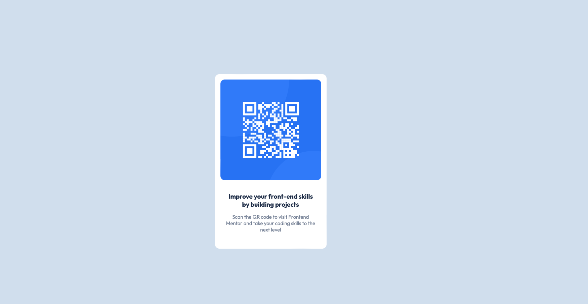

# Frontend Mentor - QR code component solution

This is a solution to the [QR code component challenge on Frontend Mentor](https://www.frontendmentor.io/challenges/qr-code-component-iux_sIO_H). Frontend Mentor challenges help you improve your coding skills by building realistic projects. 

## Table of contents

- [Overview](#overview)
  - [Screenshot](#screenshot)
  - [Links](#links)
- [My process](#my-process)
  - [Built with](#built-with)
  - [What I learned](#what-i-learned)
- [Author](#author)

**Note: Delete this note and update the table of contents based on what sections you keep.**

## Overview

This design was starting challenge. Challenge was quite easy, but provided some infor about next one.

### Screenshot

### Links

- Solution URL: https://github.com/Mafaii/Frontend-Mentor---QR-code-component-solution
- Live Site URL: https://mafaii.github.io/Frontend-Mentor---QR-code-component-solution/

## My process

- in mind that I should start with mobile-first way. I opened design for mobile and started to write necessary code.
- started with html that was needed in first look.
- then started to write css.
- while progressing some more html (div for text) was found necessary/needed at time.
- add new css for new html
- after getting it working for mobile openew desktop design
- added @media for desktop design

### Built with

- Semantic HTML5 markup
- CSS custom properties
- Flexbox
- Mobile-first workflow

### What I learned

- first thing after completing challenge I noticed that @media query was kinda overkill -> this was caused by not looking at both designs first. -> LOOK AT ALL DESIGN FIRST (and compare them) .

## Author

